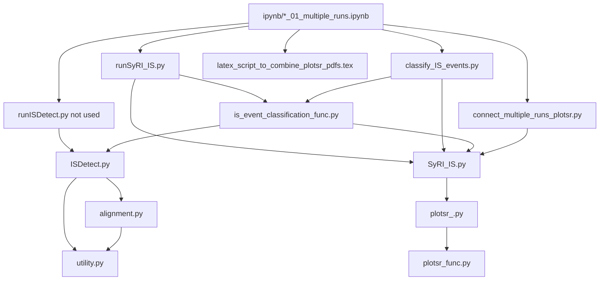

# 2024_IS_Expansion_MA

Analysis for the trial mutation accumulation experiment of *E. coli* MDS42 strain with artificial high-activity insertion sequence (IS).

## Overview

This repository contains the analysis code and Jupyter notebooks used for the corresponding publication.
It includes modules for identifying ISs, analyzing their distribution, visualizing IS variants, and more.

## Prerequisites
- Julia 1.9.3
- Python 3.9.17
- R 4.3.1

Ensure that the appropriate languages and packages are installed on your machine.
Refer to `Project.toml` and the provided Conda environment `.yml` files for the required packages.

The code was run on Ubuntu 18.04.6 LTS and on Windows Subsystem for Linux (WSL) with Ubuntu 18.04.6 LTS.

## Installation
1. Install Julia, Python, and R.
2. Install all required packages as listed in `Project.toml`.
3. Install Conda and create environments using the `.yml` files provided:
    - `20240706_syri_env3.yml` for Python dependencies.
    - `20240706_r431.yml` for R dependencies.
4. Setup R in Julia using RCall.jl. The R environment that is created in step 3 should be used when building the RCall.
5. Setup Python, R, and Julia kernels in Jupyter Notebook.

## Input Data
- Fasta files (Sequenced, reference and IS) should be placed in the `fasta` directory.
- The specification of input data should be written as in `fasta/File_list_{date}.csv`.

## Usage
1. Prepare the input files according to the specifications in the `Input` section.
2. Run `ipynb/*_01_multiple_runs.ipynb` to execute the major modules. It typically takes few hours with CPU: i9-11900, RAM: 32GB machine. GPU is not required.
3. Based on the output, manually edit the fasta files if needed. For example, this includes adding ISs in the ancestor genome if they are found in multiple descendant genomes.
4. Proceed with the analysis by running the other `.ipynb` files.

## Interdependencies of the files



## Workflow

````mermaid
graph TD;
    C["DNA Extraction: Phenol-Chloroform"]
    C -->|"DNA"| D["Sequencing: MinION/Flongle, ONT Guppy"]
    D -->|"Fastq Files"| E["Reads Assembly: Filtlong, Flye, Bandage"]
    E -->|"Assembled Draft Genomes"| F["Draft Genomes Polishing: Medaka, minimap2"]
    F -->|"Polished Sequences"|R
    R --> |"IS Excluded Genome"| G["Analysis of Structural Variation:\n SyRI, minimap2; SyRI_IS.py"]
    H["IS Insertion Sites:\nblastn; classify_IS_events.py"]
    V --> L["IS Insertion Site Distribution Analysis\n ipynb(04)"]
    R["IS Detection:\nblastn; classify_IS_events.py, ipynb(01)"]
    R -->|"List of IS loci"| I["IS Variant Visualization: gggenes\nipynb(06)"]
    G -->|"SV Data, Reconstructed Genome"| K["SV Visualization: plotsr; SyRI_IS.py, SyRI_IS.py, ipynb(01)"]
    K --> |"Figure of Sequence of SVs"| Q{"Final Sequence?"}
    Q --> |"Yes"| H2["Final Sequence"]
    Q --> |"No: Manual Fixes"| F
    H2 --> H
    H2 --> Z["Visualize IS variants \n ipynb(05-07)"]
    H2 -->M["Copy Number Variations:\nminimap2, pysam"]
    H --> |"ISs in Coordinates of\nPredecessor Genomes"|V["Annotated IS Insertion Sites:\nclassify_IS_events.py"]
    R --> |"ISs in Descendant Genomes"| V
    M --> N["Deletions & Duplications \n ipynb(02)"]
    H --> N
    M --> W["Essential genes \n ipynb(10, 11)"]
    H --> W
    V --> P["IS Loss: blastn\n ipynb(08, 09)"]
    G -->|"Potential Inversions"| U["Inversions \n ipynb(02)"]
    V --> U
````


## Modules (in src)
- `SyRI_IS`: Identification and plotting of ISs and SVs.
- `IS_detect`: Detection of IS insertion sites based on the coordinates of a reference genome. This can also be used with raw reads or assembled contigs. (Not used)
- `is_event_classification_func`: Classification of IS and SV identities.


## Analysis notebooks

`ipynb/*_01_multiple_runs.ipynb` is the main notebook to run the modules by running the following scripts: `runSyRI_IS.py`, `runISDetect.py`, `classify_IS_events.py`.
Other notebooks in ipynb directory are used for the analysis of the output data.
Example output data is provided in the `export` directory.

### Miscellaneous scripts and files to run the modules
- `src/connect_multiple_runs_plotsr.py`: Connects SyRI outputs for plotting the supplementary figure with the visualization of SVs of all lines.
- `src/plotsr_.py`, `src/plotsr_func.py`: Local clone of [plotsr](https://github.com/schneebergerlab/plotsr) with a fix for an error in the original package.
- `ipynb/20231001_plotsr.cfg`: Configuration for the plotsr package.
- `export/combine_pdf/latex_script_to_combine_plotsr_pdfs.tex`: LaTeX script to combine multiple plotsr outputs into a single PDF.

## License
This project is licensed under the MIT License - see the [LICENSE](LICENSE) file for details.

## Citation
Kanai, Y., Shibai, A., Yokoi, N., Tsuru, S., & Furusawa, C. (2024). Laboratory evolution of the bacterial genome structure through insertion sequence activation. bioRxiv, 2024-07.

https://www.biorxiv.org/content/10.1101/2024.07.14.599650

## References
Some parts of the code are written based on the following codes:

- Disdero, E., Filée, J. LoRTE: Detecting transposon-induced genomic variants using low coverage PacBio long read sequences. Mobile DNA 8, 5 (2017). https://doi.org/10.1186/s13100-017-0088-x
- Shunhua Han, Guilherme B Dias, Preston J Basting, Raghuvir Viswanatha, Norbert Perrimon, Casey M Bergman, Local assembly of long reads enables phylogenomics of transposable elements in a polyploid cell line, Nucleic Acids Research, 2022 https://doi.org/10.1093/nar/gkac794

